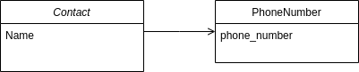

# steps to make it run
- run make db-upgrade
- run make run
- the application is now working on http://localhost:8000/contacts/

# Database design

our database contain 2 tables:
- contact: containing the contact informations.
- phone_number: containing the phone number associated to the contact.
- a one to many relationship exist between the two table which means that one contact could have multiple phone numbers.
# Remarks about the code
- in the views I used both class based views and function based views.
# Remarks on the delivery 
for the sake of simplicity i did not work on this improvements.
- adding checks for phone number format.
- improving UI and organizing html files (e.g. create a base.html which the other files extends).
- adding more experimental fields for the contact like address, country ...
- using forms for Post.

** this work does not reflect the best i can deliver in term of quality and best practises, but i will deliver it like 
this for lack of time.